# Python Project
<p align="center">
  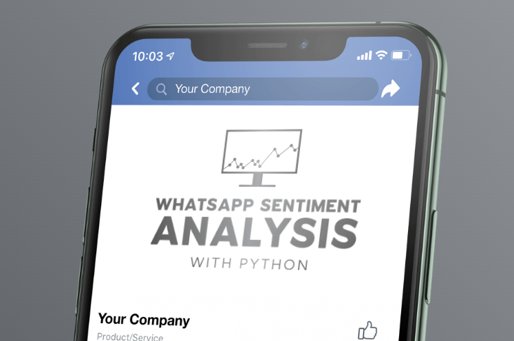
</p>

<p align="center">
  <a href="https://github.com/ockdavid"></a>
  
  
   
</p>
<!- Esto es un comentario  img alt="Lines of code https://img.shields.io/tokei/lines/github/ockdavid/Whatsapp_Sentiment_Analysis –>
<!- Introduction
Table of content
Folder structure
Requirements
Getting started
How to 
Commands
–>

<p align="center">
  
  
  
  
  
</p>


## I - Introduction

**Messaging apps like WhatsApp** have made communication easier and more accessible. However, analyzing the vast **amount of data** generated by these apps can be **challenging**. **Sentiment analysis** can help by categorizing opinions expressed in text and **understanding how people feel** about a product, service, or brand.

*That's where sentiment analysis comes in.* Sentiment analysis is a **technique** used to analyze and categorize opinions expressed in a piece of text. It's commonly used in social media monitoring, market research, and customer service to understand how people feel about a product, service, or brand.

In this project, we applied sentiment analysis to a WhatsApp group chat. We exported the chat to a text file and used **natural language processing** techniques to analyze the sentiments expressed in the messages. Our goal was to understand the overall sentiment of the conversation, as well as the sentiment of each person included in the chat.

The **purpose** of this repository is to demonstrate the potential of sentiment analysis in understanding the sentiment of messages on group chats and can be applied to any WhatsApp chat to gain insights into **people's feelings** about a particular topic or conversation. However, as our findings indicate, **sentiment analysis models are not perfect** and may require further refinement to increase their accuracy.

This repository provides the **whole code** that works perfectly, **comments** to understand it, and the **model trained** to evaluate any whatsapp chat.


## II - Table of content

- [I - Introduction](#i---introduction)
- [II - Table of content](#ii---table-of-content)
- [III - Folder structure](#iii---folder-structure)
- [IV - Getting started](#iv---getting-started)
- [V - Requirements](#v---requirements)
  - [A - Export WhatsApp chat](#a---export-whatsapp-chat)
  - [B - Download code](#b---download-code)
  - [C - Google Colab](#c---google-colab)
  - [D - HuggingFace](#d---huggingface)
- [VI - How the code works](#vi---how-the-code-works)
  - [A - Import and build the model](#a---import-and-build-the-model)
  - [B - How to Log In](#b---how-to-log-in)
  - [C - Train the model](#c---train-the-model)
  - [D - Import and clean data](#d---import-and-clean-data)
  - [E - Average sentiment](#e---average-sentiment)
  - [F - Sentiment of the chat members](#f---sentiment-of-the-chat-members)
- [VII - Results](#vii---results)
- [VIII - Observations](#viii---observations)
- [IX - Best comment](#ix---best-comment)
- [X - Conclusions](#x---conclusions)

## III - Folder structure

The structure of this project.

- `/Chats`: Whatsapp file exported
- `/NLP Datacamp`: Resources 
- `/Screenshots`: Images to show on Readme
- `/Drafts`: Some notebook drafts before the main code 

## IV - Getting started
🚀
These instructions will get you a copy of the project up and running on your local machine for development and testing purposes. 
See deployment for notes on how to deploy the project on a live system. 

In this Readme file is gonna be explained only some parts of the code because the ipynb file already has comments that explain everything.


## V - Requirements
There are some requirements to follow whether you want to play with this notebook.

### A - Export WhatsApp chat
Go to the WhatsApp chat you want to export and click on the 3 points that are on the right corner.

There will appear some options, click on More.
<p>
  
</p>

Then, there will be other options, click on export chat. 
Select the option without media and save it where you want. 
<p>
  
</p>

### B - Download code

Go to the repository web page and click on the green button Code. 

You can download the zip or clon the repository on your local computer.
<p>
  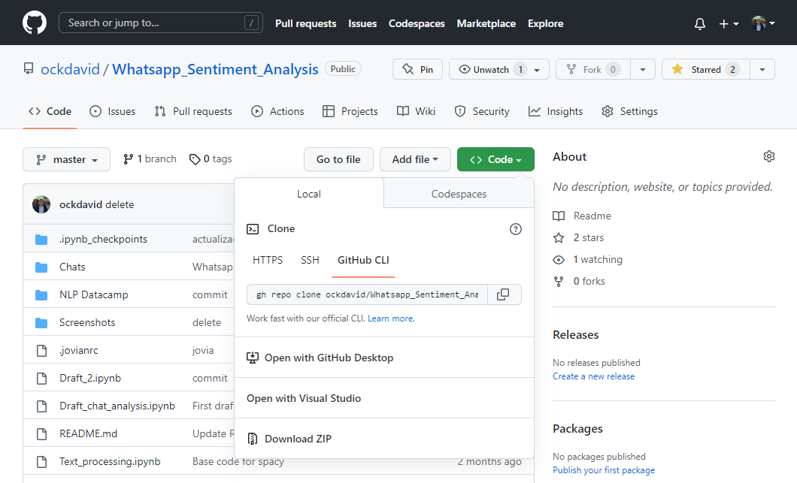
</p>

Once you get all the file, you have to look for the file Whatsapp_sentiment_analysis_BTS.ipynb

```
Whatsapp_sentiment_analysis_BTS.ipynb
```

### C - Google Colab
Register or sign up on Google Colab and open a new notebook. 

On File click on Upload notebook and select the notebook we just download from the repository.
<p>
  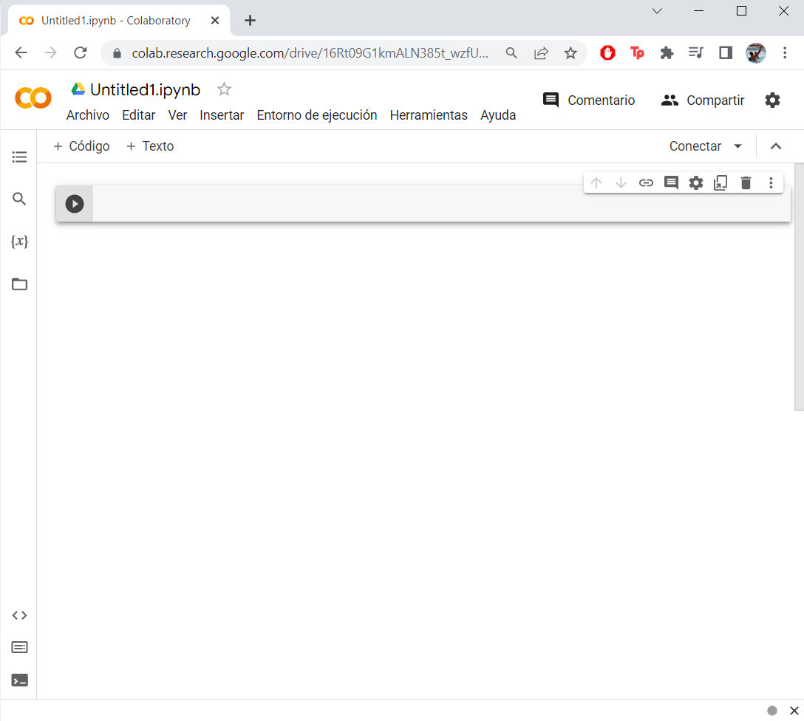
</p>


Or just press Ctrl + O to upload the ipynb file. 

<p>
  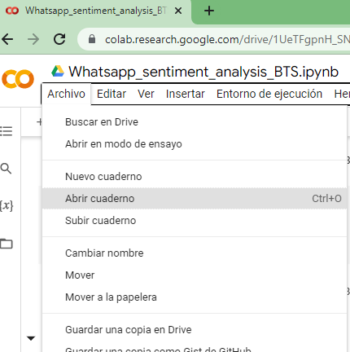
</p>

Once you uploade the ipynb, the notebook will be ready to run the cells. 

<p>
  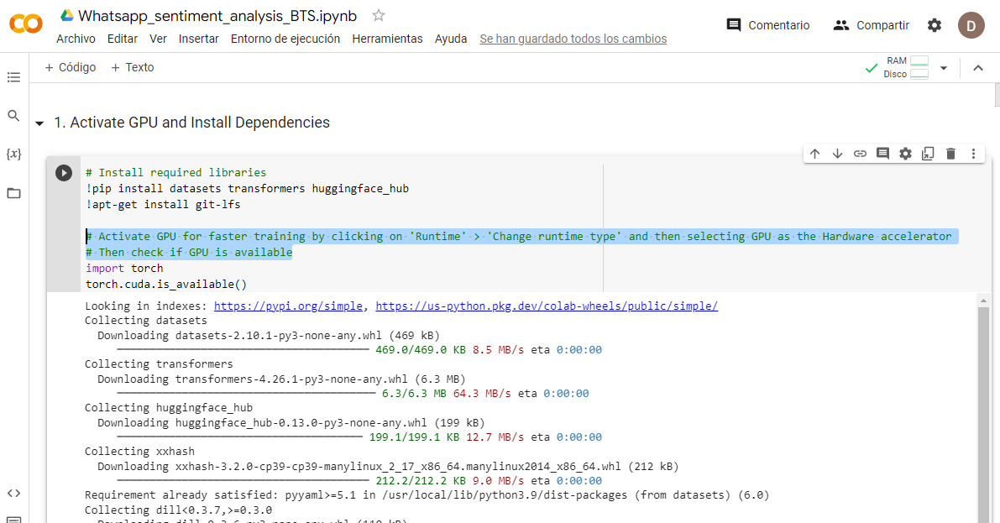
</p>


### D - HuggingFace

To train the model you have to sign up or log in on HuggingFace webpage. The process is very simple and fast. 

Once you are logged in, go to settings and click on Access Tokens to create a new token, copy it and save it to use it later. 

<p>
  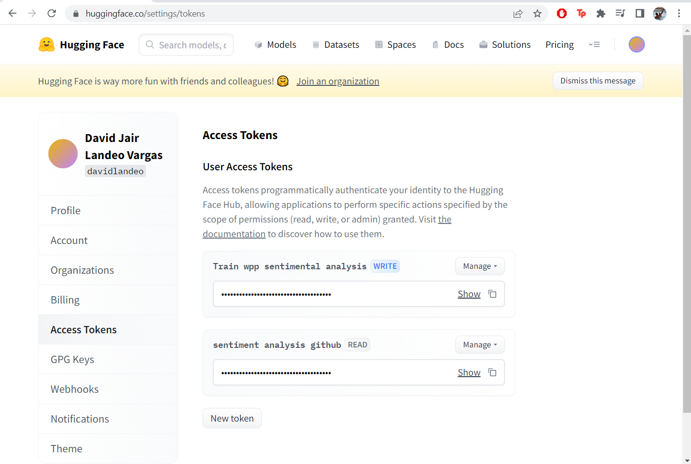
</p>


## VI - How the code works

Only some lines of code are going to be explained here.

### A - Import and build the model

Let's import some libraries.

```bash
# Install required libraries
!pip install datasets transformers huggingface_hub
!apt-get install git-lfs
import torch

# Load data
from datasets import load_dataset
imdb = load_dataset("imdb")

# Set DistilBERT tokenizer
from transformers import AutoTokenizer
tokenizer = AutoTokenizer.from_pretrained("distilbert-base-uncased")
```

We run this code to build the model.

```
# Define DistilBERT as our base model:
from transformers import AutoModelForSequenceClassification
model = AutoModelForSequenceClassification.from_pretrained("distilbert-base-uncased", num_labels=2)

from transformers import AutoTokenizer, AutoModelForSequenceClassification
tokenizer = AutoTokenizer.from_pretrained("davidlandeo/finetuning-sentiment-model-3000-samples", use_auth_token=access_token)

model = AutoModelForSequenceClassification.from_pretrained("davidlandeo/finetuning-sentiment-model-3000-samples", use_auth_token=access_token)
```

### B - How to Log In

Once you run the next code, it will ask you for a token from HuggingFace. 

```
# Log in to your Hugging Face account 
# Get your API token here https://huggingface.co/settings/token
from huggingface_hub import notebook_login
notebook_login()
```


Just copy the one you got from your account and click on ```Login```. 

<p>
  
</p>


### C - Train the model

First, we define some parameters that will train the model.

```
repo_name = "davidlandeo/finetuning-sentiment-model-3000-samples"

training_args = TrainingArguments(
    output_dir=repo_name,
    learning_rate=2e-5,
    per_device_train_batch_size=16,
    per_device_eval_batch_size=16,
    num_train_epochs=2,
    weight_decay=0.01,
    save_strategy="epoch", 
    push_to_hub=True,
)

trainer = Trainer(
    model=model,
    args=training_args,
    train_dataset=tokenized_train,
    eval_dataset=tokenized_test,
    tokenizer=tokenizer,
    data_collator=data_collator,
    compute_metrics=compute_metrics,
)
```

And, finally, traing the model. It will take some minutes to finish training.

```
trainer.train()
```

With the next line of code you can see the accuracy and the result of other metrics the model got after be trained. 

```
trainer.evaluate()
```

### D - Import and clean data

With this code we import the whatsapp file that is a text file. 

```
with open('WhatsApp BTS.txt',mode='r', encoding="utf8") as f2:
    chat = f2.read()
    print('size of chat:',len(chat))
    print('variable type:',type(chat))
    print(chat[:700])
```

With the following lines of code I delete the information about the time and the date every message have. Afterwards, I convert the variable chat (string) to a list that contains all the cleaned messages.

```
# This new list (new_chat) is gonna store individual messages after every new line(\n)
new_chat = []
a = 0
b = 0

# Splitting the whole string on each \n  
while chat.find('\n', a+1) != -1:
    a = chat.find('\n',b)
    b = chat.find('\n',a+1)
    new_chat.append(chat[a+1:b])

# create an empty set to store the names of every member of the whatsapp Group
names = set()

no_valid_data = 0

# new list that will not include the time and date
cleaned_chat = []

for i in range(len(new_chat)):
  # we verify if there is a colon 
    if (new_chat[i].count(':')):
      # Messages has at least 2 colons, that's why I'm filtering if there is only one
        if (new_chat[i].count(':') == 1) :
            no_valid_data = no_valid_data + 1
        else:
            # Findind the positions of the colons, slash, and the hyphen
            first_colon = new_chat[i].find(':')
            second_colon = new_chat[i].find(':',first_colon+1)
            slash = new_chat[i].find('/')
            hyphen = new_chat[i].find('-')
            
            # With the positions of the colons and the slash, we can evaluate if the message is valid to assign to a person
            if (first_colon>=9) and (first_colon<=13) and (slash<4):    
              nombre = new_chat[i][hyphen+2:second_colon]
              names.add(nombre)
              cleaned_chat.append(new_chat[i][hyphen+2:])
```


### E - Average sentiment

This cell get the average sentiment of all the messages of the chat. 

```
negative_values = []
positive_values = []

for mssge in cleaned_chat:
  
  val = sentiment_model(mssge)                        # Analyze the sentiment of every message

  if val[0].get('score') >= 0.55:                     # The score has to be at least 0.55 to be counted
                                                      # Less than 0.55 doesn't make much sense
    if val[0].get('label') == 'LABEL_0':
      negative_values.append(val[0].get('score'))     # LABEL_0 means it's negative
    else:
      positive_values.append(val[0].get('score'))     # LABEL_1 means it's negative
```


### F - Sentiment of the chat members

The sentiment of each message will be evaluate it and each score will be saved on a list of the owner's message.

```
# Create a dictionary with the names of all the members of the whatsapp group
# For negative and positive messages

name_lists_positive = {name: [] for name in names}
name_lists_negative = {name: [] for name in names}

# Get the sentiment analysis of each person
for mssge in cleaned_chat:
  first_colon = mssge.find(':')
  val = sentiment_model(mssge)                                  # Evaluate the sentiment of each message
  nombre = mssge[:first_colon]                                  # Get only the name of the person who sent the message
  
  # Save the result of its sentiment of each person in the dictionary
  if (nombre in names):
    if (val[0].get('label')== 'LABEL_0'):
      name_lists_negative[nombre].append(val[0].get('score'))
    elif (val[0].get('label')== 'LABEL_1'):
      name_lists_positive[nombre].append(val[0].get('score'))

# Get the average of all the messages' sentiment that are positive of everyone

average_positive = {name: [] for name in names}
for name in names:
  average_positive[name].append(np.mean(name_lists_positive[name]))

# Get the average of all the messages' sentiment that are positive of everyone

average_negative = {name: [] for name in names}
for name in names:
  average_negative[name].append(np.mean(name_lists_negative[name]))
```


## VII - Results

There are roughly 60 people in this WhatsApp group, but here I'm going to present only the first 10 of the list. 

They are not ordered by score and some of them are named "Unknown" because I don't know them. 

Some of them doesn't have a score because not everyone send messages.

```
Positive_results
```

<p>
  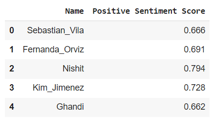
</p>

This is how are stored the comments per person on the database: 

<p>
  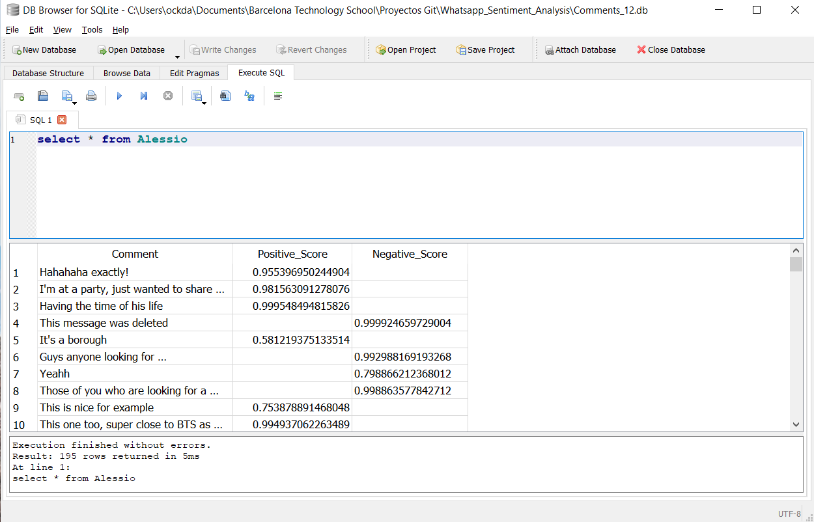
</p>

This graph presents the score of some of the people presented in the WhatsApp group.

<p>
  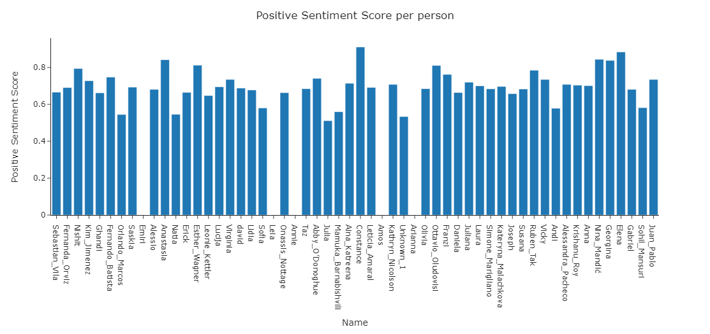
</p>


## VIII - Observations

There are some predictions that were not made correctly like the following examples: 

- According to the model, this message is negative (because the label key says LABEL_0) with the score of 0.77, but it's not negative because the message is congratulating someone. 
 
```
i = 1260
val = sentiment_model(cleaned_chat[i])
print(cleaned_chat[i])
val
```

<p>
  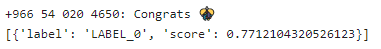
</p>


- According to the model, this message is negative (because the label key says LABEL_0) with the score of 0.81, but it's not negative because the message is asking about to play beach volleyball. It should be more neutral than positive or negative. 
 
```
i = 476
val = sentiment_model(cleaned_chat[i])
print(cleaned_chat[i])
val
```

<p>
  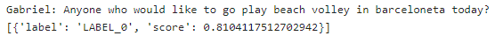
</p>


- But there are some cases where the model, aparently, predicted corrrectly. LABEL_1 means the message is positive. 
 
```
i = 233
val = sentiment_model(cleaned_chat[i])
print(cleaned_chat[i])
val
```

<p>
  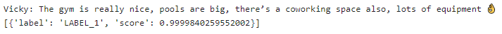
</p>


## IX - Best comment

In this case, according to the model, this is the best positive comment of all the messages of the chat.

<p>
  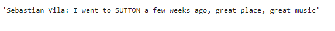
</p>

## X - Conclusions

* The model has a overfitting problem. 

* Some sentiment analysis libraries determine whether data is positive, negative or neutral. This model doesn't give off neutral outputs.

* Not all the comments can be positive or negative, this model should implement neutral outputs.

