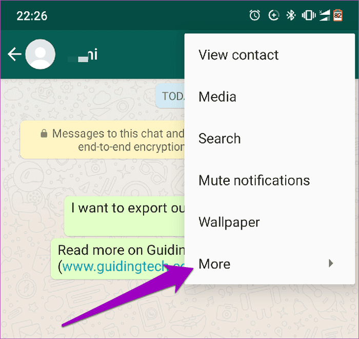
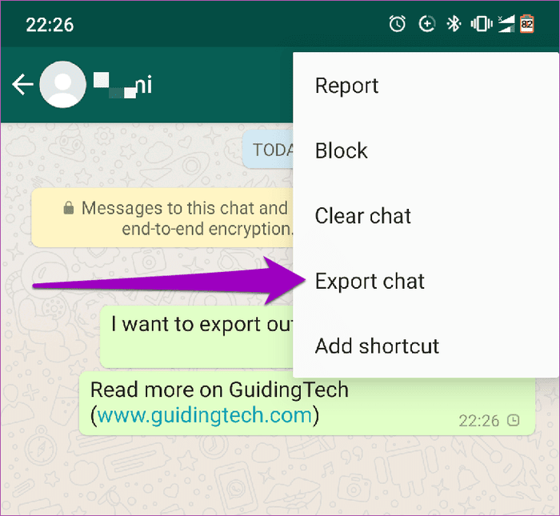

# Python Project
<p align="center">
  
</p>

<p align="center">
  <a href="https://github.com/ockdavid"></a>
  
  
   
</p>
<!- Esto es un comentario  img alt="Lines of code https://img.shields.io/tokei/lines/github/ockdavid/Whatsapp_Sentiment_Analysis –>
<!- Introduction
Table of content
Folder structure
Requirements
Getting started
How to 
Commands
–>

<p align="center">
  
  
  

</p>


## I - Introduction

**Messaging apps like WhatsApp** have made communication easier and more accessible. However, analyzing the vast **amount of data** generated by these apps can be **challenging**. **Sentiment analysis** can help by categorizing opinions expressed in text and **understanding how people feel** about a product, service, or brand.

*That's where sentiment analysis comes in.* Sentiment analysis is a **technique** used to analyze and categorize opinions expressed in a piece of text. It's commonly used in social media monitoring, market research, and customer service to understand how people feel about a product, service, or brand.

In this project, we applied sentiment analysis to a WhatsApp group chat. We exported the chat to a text file and used **natural language processing** techniques to analyze the sentiments expressed in the messages. Our goal was to understand the overall sentiment of the conversation, as well as the sentiment of each person included in the chat.

The **purpose** of this repository is to demonstrate the potential of sentiment analysis in understanding the sentiment of messages on group chats and can be applied to any WhatsApp chat to gain insights into **people's feelings** about a particular topic or conversation. However, as our findings indicate, **sentiment analysis models are not perfect** and may require further refinement to increase their accuracy.

This repository provides the **whole code** that works perfectly, **comments** to understand it, and the **model trained** to evaluate any whatsapp chat.


## II - Table of content

- [I - Introduction](#i---introduction)
- [II - Table of content](#ii---table-of-content)
- [III - Folder structure](#iii---folder-structure)
- [IV - Getting started](#iv---getting-started)
- [V - Requirements](#v---requirements)
  - [A - Export WhatsApp chat](#a---export-whatsapp-chat)
  - [B - Download code](#b---download-code)
  - [C - Google Colab](#c---google-colab)
  - [D - HuggingFace](#d---huggingface)
- [VI - How the code works](#vi---how-the-code-works)
  - [A - Import and build the model](#a---import-and-build-the-model)
  - [B - How to Log In](#b---how-to-log-in)
  - [C - Train the model](#c---train-the-model)
  - [D - Export and clean data](#d---export-and-clean-data)
  - [E - Average sentiment](#e---average-sentiment)
  - [F - Sentiment of the chat members](#f---sentiment-of-the-chat-members)
- [VII - Results](#vii---results)
- [VIII - Observations](#viii---observations)
- [IX - Best comment](#ix---best-comment)
- [X - Conclusions](#x---conclusions)

## III - Folder structure

The structure of this project.

- `/Chats`: Whatsapp file exported
- `/NLP Datacamp`: Resources 
- `/Screenshots`: Images to show on Readme
- `/Drafts`: Some notebook drafts before the main code 

## IV - Getting started
🚀
These instructions will get you a copy of the project up and running on your local machine for development and testing purposes. 
See deployment for notes on how to deploy the project on a live system. 


## V - Requirements
There are some requirements to follow whether you want to play with this code.

### A - Export WhatsApp chat
Go to the WhatsApp chat you want to export and click on the 3 points that are on the right corner.

There will appear some options, click on More.
<p>
  
</p>

Then, there will be other options, click on export chat. 
Select the option without media and save it where you want. 
<p>
  
</p>

### B - Download code

Go to the repository web page and click on the green button Code. 

You can download the zip or clon the repository on your local computer.
<p>
  
</p>

Once you get all the file, you have to look for the file Whatsapp_sentiment_analysis_BTS.ipynb

```
Whatsapp_sentiment_analysis_BTS.ipynb
```

[](https://github.com/gogolcorp/go-yave/actions/workflows/cd.docker.yml)

The **CD** workflow is located at [.github/workflows/cd.docker.yml](.github/workflows/cd.docker.yml). It's triggered a **each push** on **`main` branch**.

It consist of:

- **login** into the GitHub container registry (ghcr.io)
- **build and push** the Golang api using the **production Dockerfile** located at [build/pakage/sample-api/Dockerfile](build/pakage/sample-api/Dockerfile)

After that, you can check the **pushed container** at: `https://github.com/<username>?tab=packages&repo_name=<repository-name>`

> IMPORTANT: you need to **update the production Dockerfile** with your **username** AND **_repository name_**. Otherwise, there will be errors at push:

```bash
LABEL org.opencontainers.image.source = "https://github.com/<username>/<repository-name>"
```

## VI - How the code works

The project use **Docker** and **Docker Compose** to build and run local and distant images in our workspace.

### A - Import and build the model

All the images use the **same network**, more informations at [docker-compose.yml](docker-compose.yml)

| CONTAINER | PORT        | IMAGE                                                                    |
| :-------- | :---------- | :----------------------------------------------------------------------- |
| GOLANG    | `3333:3333` | [build/pakage/sample-api/Dockerfile](build/pakage/sample-api/Dockerfile) |
| ADMINER   | `3334:8080` | [build/package/adminer/Dockerfile](build/package/adminer/Dockerfile)     |
| POSTGRES  | `5432:5432` | [postgres:latest](https://hub.docker.com/_/postgres)                     |

> Adminer is a GUI that allows us to **manage your database** by permetting to to **create, edit, delete** the different entities, tables, etc.

### B - How to Log In

#### TL;DR <!-- omit in toc -->

```bash
make setup-env start logs
```

#### `make help` <!-- omit in toc -->

**Display** informations about other commands.

### C - Train the model

### D - Export and clean data

### E - Average sentiment

### F - Sentiment of the chat members


## VII - Results

See [CONTRIBUTING.md](assets/docs/CONTRIBUTING.md) for more informations.

## VIII - Observations

Under [MIT](./LICENSE) license.

## IX - Best comment


## X - Conclusions

* The model has a overfitting problem. 

* Some sentiment analysis libraries determine whether data is positive, negative or neutral. This model doesn't give off neutral outputs.

* Not all the comments can be positive or negative, this model should implement neutral outputs.

